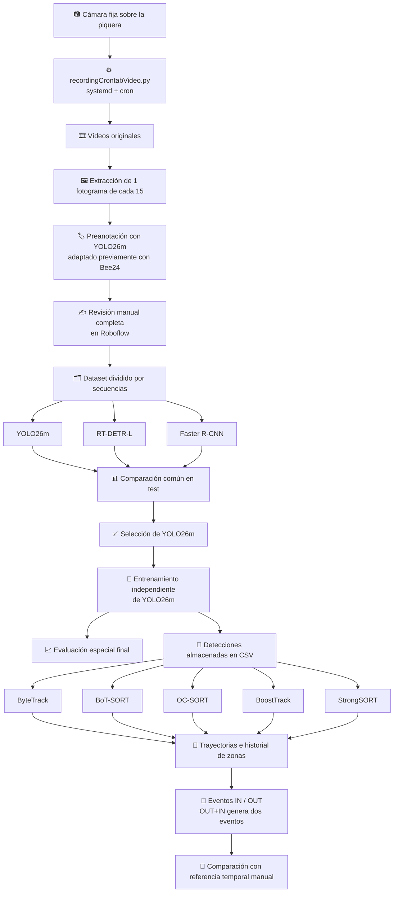

<div align="center">

# 🐝 Beehive Entrance Monitoring

### Detección, seguimiento y conteo de eventos de abejas mediante visión artificial

**Trabajo Fin de Grado — Grado en Ingeniería Informática**

<br>


</div>

---

Este repositorio contiene el prototipo desarrollado para el Trabajo Fin de Grado
**«Estudio para el conteo de abejas en colmenas usando visión artificial»**.

El sistema procesa vídeos de la piquera de una colmena para **detectar abejas**, **construir trayectorias** mediante seguimiento multiobjeto y **contabilizar eventos temporales de entrada (`IN`) y salida (`OUT`)**.

> [!IMPORTANT]
> El sistema cuenta **eventos de tránsito**, no individuos biológicamente únicos. Una misma abeja puede producir varios eventos durante una secuencia.

### ✨ Resumen rápido

| Bloque | Resultado / configuración |
|---|---|
| 📷 Adquisición | Logitech C920 HD Pro · 1280×720 · 30 FPS · vídeos de 60 s |
| 🗂️ Dataset | 9245 imágenes · 78 secuencias |
| 🧠 Detectores comparados | YOLO26m · RT-DETR-L · Faster R-CNN |
| ✅ Detector seleccionado | YOLO26m |
| 🎯 Evaluación YOLO seleccionada | mAP50 **98.61 %** · mAP50–95 **80.78 %** |
| 🔗 Trackers comparados | ByteTrack · BoT-SORT · OC-SORT · BoostTrack · StrongSORT |
| ✅ Tracker seleccionado | ByteTrack |
| 🐝 Referencia temporal | 757 eventos · 377 `IN` · 380 `OUT` |
| ⚡ Detección en CPU | 467.28 ms/frame · 2.14 FPS |
| 🚀 ByteTrack | 1.33 ms por `tracker.update(...)` |

### 🔄 Flujo general

`Captura → Preanotación → Dataset → Detección → Tracking → Trayectorias → Eventos IN/OUT → Evaluación`


---

## 🧭 Contenido

- [🎯 Alcance](#alcance)
- [🎥 Adquisición de vídeo](#adquisicion-video)
- [🧩 Arquitectura del sistema](#arquitectura)
- [🗂️ Conjunto de datos](#dataset)
- [📊 Resultados principales](#resultados)
- [📁 Estructura del repositorio](#estructura)
- [🧰 Requisitos](#requisitos)
- [⚙️ Instalación](#instalacion)
- [🗃️ Preparación de archivos](#preparacion)
- [▶️ Ejecución por etapas](#ejecucion)
- [📦 Archivos generados](#archivos-generados)
- [🎛️ Parámetros del sistema final](#parametros)
- [🔁 Reproducibilidad](#reproducibilidad)
- [⚠️ Limitaciones](#limitaciones)
- [👤 Autoría](#autoria)

---

<a id="alcance"></a>
## 🎯 Alcance

El proyecto se ha desarrollado como un **prototipo experimental** para analizar vídeos previamente grabados en una única colmena y con una cámara situada en un encuadre fijo.

El trabajo incluye:

- adquisición automática de vídeos de la piquera mediante una cámara fija, `recordingCrontabVideo.py`, `systemd` y programación externa con `cron`;
- extracción de fotogramas y preanotación automática;
- revisión manual de anotaciones en Roboflow;
- partición del conjunto de datos por secuencias;
- entrenamiento de YOLO26m, RT-DETR-L y Faster R-CNN;
- comparación común de los tres detectores sobre el mismo conjunto de test;
- entrenamiento independiente y evaluación espacial del detector YOLO seleccionado;
- generación de una caché común de detecciones;
- comparación de ByteTrack, BoT-SORT, OC-SORT, BoostTrack y StrongSORT;
- creación de una referencia temporal manual asistida;
- evaluación de eventos `IN` y `OUT`;
- medición independiente del coste de detección y de actualización de los *trackers*;
- generación de un vídeo demostrativo.

El proyecto **no** incluye:

- una aplicación web o un panel Streamlit;
- identificación biométrica persistente de cada abeja;
- evaluación MOTChallenge mediante MOTA o IDF1;
- despliegue permanente en tiempo real;
- validación externa sobre varias colmenas o diferentes posiciones de cámara;
- un producto industrial preparado para trabajar de forma autónoma a la intemperie.

---

<a id="adquisicion-video"></a>
## 🎥 Adquisición de vídeo

Los vídeos utilizados en el proyecto se obtuvieron mediante una cámara **Logitech C920 HD Pro** instalada en posición fija y con vista cenital de la piquera. La configuración utilizada durante la adquisición fue de **1280 × 720 píxeles**, **30 FPS** y vídeos de **60 segundos**.

La adquisición automática se implementó mediante dos archivos:

- `recordingCrontabVideo.py`: realiza la captura y escritura de los vídeos;
- `recording_beehive_entrance.service`: servicio de `systemd` que mantiene activo el proceso de adquisición.

La programación horaria se gestionó de forma externa mediante `cron`. En la instalación utilizada, `cron` activaba el sistema diariamente entre las **08:00 y las 22:00**, mientras que `systemd` se encargaba de mantener el proceso de grabación en ejecución mientras el servicio estaba iniciado. Por tanto, `cron` y `systemd` cumplen funciones diferentes.

### Script `recordingCrontabVideo.py`

El script abre la cámara mediante el backend V4L2 de OpenCV:

```python
cv2.VideoCapture(0, cv2.CAP_V4L2)
```

Los principales argumentos disponibles son:

| Argumento | Descripción |
|---|---|
| `-duration` | Duración objetivo de cada vídeo, en segundos |
| `-frameWidth` | Anchura de captura |
| `-frameHeigth` | Altura de captura; se conserva este nombre por compatibilidad con el script |
| `-fps` | Frecuencia de fotogramas solicitada |
| `-focusValue` | Valor opcional de enfoque manual |
| `-path` | Directorio de salida |

La configuración utilizada en el proyecto puede ejecutarse directamente mediante:

```bash
python3 recordingCrontabVideo.py \
  -duration 60 \
  -frameWidth 1280 \
  -frameHeigth 720 \
  -fps 30 \
  -focusValue 40 \
  -path /home/beesound/videoRecording/videos-piqueras
```

Durante la inicialización se descartan 20 fotogramas antes de configurar la cámara y otros 20 después de aplicar los parámetros, con el objetivo de dar tiempo a que la captura se estabilice. Cuando se proporciona `-focusValue`, se desactiva el enfoque automático continuo y se aplica el valor de enfoque indicado. En la configuración utilizada también se ejecutan:

```text
exposure_dynamic_framerate=0
gain=100
```

Cada vídeo se escribe en formato MP4 dentro de una carpeta correspondiente a la fecha de grabación. Los nombres siguen el patrón:

```text
YYYY-MM-DD/YYYY-MM-DD_HH-MM-SS.mp4
```

Antes de comenzar un nuevo vídeo se comprueba que existan al menos **5 GB de espacio libre** en el directorio de destino. El script calcula el número objetivo de fotogramas como:

```text
duration × fps
```

Por tanto, con la configuración utilizada intenta escribir hasta `60 × 30 = 1800` fotogramas por vídeo. Si `cap.read()` falla antes de completar esa cantidad, el vídeo puede contener menos fotogramas.

El script también registra cada inicio en:

```text
/tmp/debug_camara.log
```

### Servicio `recording_beehive_entrance.service`

El servicio permite mantener activo el proceso de adquisición mediante `systemd`.

<details>
<summary><strong>Ver configuración del servicio</strong></summary>

```ini
[Service]
User=root
WorkingDirectory=/home/beesound/videoRecording
ExecStart=/bin/bash -c "source /home/beesound/videoRecording/opencv-env/bin/activate && python3 -u /home/beesound/videoRecording/recordingCrontabVideo.py -duration 60 -frameWidth 1280 -frameHeigth 720 -fps 30 -focusValue 40 -path /home/beesound/videoRecording/videos-piqueras"
Restart=always
RestartSec=5

[Install]
WantedBy=default.target
```

</details>

`Restart=always` hace que `systemd` vuelva a lanzar el proceso cuando termina y `RestartSec=5` introduce una espera de cinco segundos antes del reinicio.

> [!WARNING]
> Las rutas corresponden al equipo utilizado durante el TFG. En otra máquina deben adaptarse `WorkingDirectory`, la ruta del entorno virtual, `recordingCrontabVideo.py` y el directorio de salida.

### Programación mediante `cron`

La activación diaria entre las 08:00 y las 22:00 se configuró externamente mediante `cron`. El archivo de `crontab` empleado no forma parte de los recursos finales conservados en este repositorio, por lo que no se incluye aquí una configuración concreta que no pueda verificarse.

Para reproducir el sistema debe configurarse en la máquina de adquisición una programación equivalente que inicie y detenga `recording_beehive_entrance.service` en el horario deseado.

---

<a id="arquitectura"></a>
## 🧩 Arquitectura del sistema

El flujo experimental completo es el siguiente:



La detección y el seguimiento se ejecutan como etapas separadas. El detector seleccionado procesa cada vídeo una única vez y sus predicciones se almacenan en CSV. Los cinco *trackers* reciben posteriormente **las mismas detecciones**, de forma que las diferencias entre sus resultados no dependen de ejecutar el detector de manera distinta para cada algoritmo.

---

<a id="dataset"></a>
## 🗂️ Conjunto de datos

El conjunto de datos espacial definitivo está formado por **9245 imágenes procedentes de 78 secuencias**.

| Partición | Secuencias | Imágenes | Positivas | Fondo |
|---|---:|---:|---:|---:|
| Entrenamiento | 54 | 6383 | 4675 | 1708 |
| Validación | 12 | 1431 | 900 | 531 |
| Test | 12 | 1431 | 958 | 473 |
| **Total** | **78** | **9245** | **6533** | **2712** |

Las secuencias completas se asignan a una única partición para reducir el riesgo de *data leakage* temporal entre fotogramas próximos.

Las proporciones objetivo son:

- 70 % para entrenamiento;
- 15 % para validación;
- 15 % para test;
- semilla aleatoria fija: `42`.

Antes del reparto, las secuencias se agrupan según su proporción de imágenes de fondo: al menos 70 %, entre 10 % y 70 %, o menos de 10 %. Dentro de cada grupo se cambia el orden con la semilla fija. El script procesa primero las secuencias con alta presencia de fondo, después las mixtas y finalmente las que presentan alta presencia de imágenes positivas. Cada secuencia completa se asigna a la partición que, en ese momento, ha alcanzado una menor proporción de su número objetivo de imágenes.

Las imágenes sin abejas se conservan como muestras negativas mediante archivos de etiquetas vacíos.

---

<a id="resultados"></a>
## 📊 Resultados principales

### Comparación común de detectores

Los tres modelos se evaluaron sobre las mismas 1431 imágenes de test. Los valores puntuales de *Precision* y *Recall* utilizan `conf = 0.25` e `IoU ≥ 0.50`, con emparejamiento uno a uno. Las métricas mAP y mAR se calcularon mediante TorchMetrics. Las primeras 30 imágenes se excluyeron únicamente de la medición temporal.

| Modelo | Épocas completadas | Precision | Recall | mAP50 | mAP50–95 | mAR100 | Tiempo medio | FPS |
|---|---:|---:|---:|---:|---:|---:|---:|---:|
| YOLO26m | 15 | 90.93 % | 96.91 % | 97.93 % | 74.32 % | 79.85 % | 455.52 ms | 2.20 |
| RT-DETR-L | 13 | 80.70 % | 96.83 % | 96.53 % | 65.99 % | 73.43 % | 1196.56 ms | 0.84 |
| Faster R-CNN ResNet50-FPN v2 | 16 | 82.09 % | 98.21 % | 97.41 % | 73.33 % | 77.75 % | 2999.94 ms | 0.33 |

Los entrenamientos de RT-DETR-L y Faster R-CNN se configuraron inicialmente con un máximo de 150 épocas. Debido a su elevado coste computacional y a las limitaciones de duración de las sesiones disponibles en Kaggle, las ejecuciones utilizadas en la comparación pudieron completarse hasta 13 épocas para RT-DETR-L y 16 para Faster R-CNN. Para la comparación se conservaron los mejores *checkpoints* obtenidos durante esas ejecuciones. Por tanto, los entrenamientos no utilizaron un presupuesto computacional idéntico y la comparación debe interpretarse dentro de las condiciones experimentales utilizadas.

### Detector YOLO seleccionado

Después de seleccionar YOLO26m, se realizó un entrenamiento independiente configurado con un máximo de 150 épocas y una paciencia de 25 épocas. El sistema final utiliza `best_yolo.pt`, correspondiente al mejor *checkpoint* de validación conservado durante esa ejecución.

La evaluación espacial realizada mediante el módulo de validación de Ultralytics obtuvo:

| Métrica | Resultado |
|---|---:|
| Precision | 96.25 % |
| Recall | 94.86 % |
| mAP50 | 98.61 % |
| mAP50–95 | 80.78 % |

Esta evaluación utiliza un *checkpoint* y un evaluador diferentes de los empleados en la comparación común de arquitecturas, por lo que ambos resultados no deben interpretarse como una comparación directa de mejora.

### Seguimiento y conteo

La referencia temporal está formada por 12 vídeos y contiene **757 eventos**:

- 377 eventos `IN`;
- 380 eventos `OUT`.

La evaluación utiliza un emparejamiento temporal uno a uno, independiente para cada tipo de evento, con una tolerancia inclusiva de `±30` fotogramas.

| Tracker | Precision IN | Recall IN | Error abs. IN | Precision OUT | Recall OUT | Error abs. OUT | Eventos predichos |
|---|---:|---:|---:|---:|---:|---:|---:|
| ByteTrack | 86.13 % | 79.05 % | 31 | 92.31 % | 66.32 % | 107 | 619 |
| BoT-SORT | 83.91 % | 77.45 % | 29 | 94.72 % | 61.32 % | 134 | 594 |
| StrongSORT | 82.58 % | 67.90 % | 67 | 91.34 % | 55.53 % | 149 | 541 |
| OC-SORT | 84.00 % | 61.27 % | 102 | 94.36 % | 48.42 % | 185 | 470 |
| BoostTrack | 85.71 % | 58.89 % | 118 | 94.74 % | 47.37 % | 190 | 449 |

> [!NOTE]
> **ByteTrack** fue seleccionado por presentar el mejor equilibrio global entre recuperación de eventos, precisión y coste computacional dentro de los algoritmos evaluados.

### Rendimiento computacional

La generación de detecciones utilizada en la evaluación temporal se ejecutó en CPU. A partir de los tiempos por vídeo almacenados en `detections_summary.csv`, ponderados por los fotogramas temporizados después del *warm-up*, se obtiene:

- tiempo medio: **467.28 ms por fotograma**;
- rendimiento equivalente: **2.14 FPS**;
- fotogramas incluidos en la medición: **21095**.

Esta medición incluye la inferencia de YOLO, la transferencia de las predicciones a CPU y el filtro mínimo de tamaño. No incluye la escritura de las detecciones en CSV.

Los tiempos siguientes corresponden exclusivamente a `tracker.update(...)`; no incluyen inferencia YOLO, lógica de conteo ni escritura de resultados.

| Tracker | Tiempo medio | Mediana | Desviación típica | FPS de actualización |
|---|---:|---:|---:|---:|
| ByteTrack | 1.33 ms | 0.98 ms | 1.39 ms | 752.77 |
| OC-SORT | 2.46 ms | 1.15 ms | 2.91 ms | 406.85 |
| StrongSORT | 35.14 ms | 31.42 ms | 31.32 ms | 28.46 |
| BoT-SORT | 35.34 ms | 31.37 ms | 30.31 ms | 28.29 |
| BoostTrack | 37.71 ms | 32.98 ms | 32.80 ms | 26.52 |

> [!TIP]
> En la configuración evaluada, el **principal coste computacional corresponde a la detección**, mientras que la actualización de ByteTrack es mucho más rápida.

---

<a id="estructura"></a>
## 📁 Estructura del repositorio

Una estructura compatible con los scripts finales es:

```text
beehive-entrance-monitoring/
├── data/
│   ├── videos_originales/            # Vídeos usados para extraer/preanotar imágenes
│   ├── preannotations/               # Salida automática previa a la revisión manual
│   ├── reviewed/                     # Secuencias revisadas: images/ y labels/
│   ├── videos_evaluacion_temporal/   # Vídeos usados en la evaluación temporal
│   └── gt/                           # Referencia temporal .txt: frame,event
│
├── datasets/
│   └── bee_dataset/
│       ├── train/
│       │   ├── images/
│       │   └── labels/
│       ├── val/
│       │   ├── images/
│       │   └── labels/
│       ├── test/
│       │   ├── images/
│       │   └── labels/
│       ├── data.yaml
│       └── auditoria_dataset.csv
│
├── model/
│   ├── best_yolo.pt                 # Detector seleccionado utilizado en las etapas finales
│   ├── best_yolo_15.pt              # YOLO usado en la comparación
│   ├── best_rtder.pt                # RT-DETR usado en la comparación
│   └── best_fasterrcnn.pt           # Faster R-CNN usado en la comparación
│
├── results/
│   ├── detector_comparison/
│   │   ├── comparacion_detectores_test.csv
│   │   └── comparacion_detectores_test.json
│   ├── detections/
│   │   ├── detections_<video>.csv
│   │   ├── detections_summary.csv
│   │   └── detection_run_config.json
│   ├── benchmark/
│   │   ├── results_<tracker>_<video>.csv
│   │   ├── summary_by_tracker.csv
│   │   └── summary_timing_global_by_tracker.csv
│   ├── tracker_comparison/
│   │   └── metricas_globales_tfg.csv
│   ├── detection_evaluation/
│   │   ├── auditoria_deteccion_final.csv
│   │   └── spatial_evaluation/
│   └── videos/
│       └── demo.mp4
│
├── scripts/
│   ├── 0_pre_annotate.py
│   ├── 1_prepare_data.py
│   ├── 2_train_yolo.py
│   ├── 2_train_rtdetr.py
│   ├── 2_train_fasterrcnn.py
│   ├── 3A_generate_detections.py
│   ├── 3B_benchmark_trackers.py
│   ├── 4_evaluate_count.py
│   ├── 5_evaluate_model_detection.py
│   ├── 6_generate_video.py
│   ├── compare_detectors_local.py
│   ├── ground_truth.py
│   ├── recordingCrontabVideo.py
│   └── recording_beehive_entrance.service
│
├── memoria/
│   ├── TFG_FINAL.pdf
│   └── fuentes_latex/
│
├── osnet_x0_25_msmt17.pt
├── rtdetr-l.pt
├── yolo26m.pt
├── requirements.txt
└── README.md
```

Los vídeos, conjuntos de datos y pesos pueden quedar fuera del control de versiones debido a su tamaño. En ese caso, al mover el proyecto a otro equipo deben conservarse los nombres esperados por los scripts o actualizarse explícitamente las rutas utilizadas en los comandos.

El *checkpoint* empleado para la preanotación es el modelo YOLO26m previamente adaptado con Bee24. Su nombre exacto no está fijado en los scripts finales, por lo que debe proporcionarse mediante el argumento `--model` al ejecutar `0_pre_annotate.py`.

---

<a id="requisitos"></a>
## 🧰 Requisitos

El entorno final utilizado para la ejecución y evaluación en CPU corresponde a Python 3.12.7 y tiene las versiones fijadas en `requirements.txt`.

Dependencias principales:

- `torch==2.12.0`;
- `torchvision==0.27.0`;
- `ultralytics==8.4.14`;
- `opencv-python==4.13.0.92`;
- `Pillow==12.2.0`;
- `boxmot==17.0.0`;
- `torchmetrics==1.9.0`;
- `pycocotools==2.0.11`;
- `numpy==2.4.4`;
- `pandas==2.3.3`;
- `PyYAML==6.0.3`;
- `tqdm==4.67.3`.

Para reproducir el benchmark de *trackers* deben conservarse, además, los pesos `osnet_x0_25_msmt17.pt` utilizados por BoxMOT para los algoritmos que requieren información de apariencia.

Para utilizar el sistema de adquisición de vídeo se necesita además un entorno Linux con acceso a la cámara mediante V4L2, el comando `v4l2-ctl`, `systemd` y `cron`. Estos componentes son dependencias del sistema operativo y no se instalan mediante `requirements.txt`. El script utilizado en el proyecto accede a la cámara como `/dev/video0`.

---

<a id="instalacion"></a>
## ⚙️ Instalación

### 1. Crear un entorno virtual

```bash
python -m venv .venv
```

En Windows:

```powershell
.venv\Scripts\activate
```

En Linux o macOS:

```bash
source .venv/bin/activate
```

### 2. Actualizar `pip`

```bash
python -m pip install --upgrade pip
```

### 3. Instalar las dependencias

Para reproducir el entorno final documentado:

```bash
pip install -r requirements.txt
```

Si se utiliza una plataforma distinta, debe comprobarse previamente que la instalación de PyTorch sea compatible con el hardware y el sistema operativo utilizados.

### 4. Comprobar la instalación

```bash
python -c "import torch, cv2, ultralytics, boxmot; print('Entorno correcto')"
```

---

<a id="preparacion"></a>
## 🗃️ Preparación de archivos

Para reproducir la adquisición automática deben estar disponibles:

```text
recordingCrontabVideo.py
recording_beehive_entrance.service
```

El servicio contiene rutas absolutas correspondientes al equipo utilizado durante el TFG y debe adaptarse si se despliega en otra máquina.

Para ejecutar las etapas finales de evaluación deben estar disponibles, como mínimo:

```text
model/best_yolo.pt
datasets/bee_dataset/data.yaml
data/videos_evaluacion_temporal/*.mp4
data/gt/*.txt
osnet_x0_25_msmt17.pt
```

La referencia temporal final incluida en el proyecto se conserva en archivos `.txt` con contenido `frame,event`. El evaluador temporal admite tanto archivos `.txt` como `.csv`.

Para repetir la comparación de detectores también deben estar disponibles:

```text
model/best_yolo_15.pt
model/best_rtder.pt
model/best_fasterrcnn.pt
```

Para repetir la preanotación debe conservarse el *checkpoint* YOLO26m adaptado previamente con Bee24 y pasar su ruta mediante `--model`.

Los nombres base de los vídeos y de los archivos temporales deben corresponderse. Para un vídeo:

```text
data/videos_evaluacion_temporal/secuencia_01.mp4
```

la detección almacenada será:

```text
results/detections/detections_secuencia_01.csv
```

y el archivo de referencia temporal debe tener el mismo nombre base:

```text
data/gt/secuencia_01.txt
```

El campo `path:` de `data.yaml` puede contener una ruta absoluta generada en otra máquina. Debe actualizarse antes de entrenar o validar. El comparador común permite sobrescribir esta ruta mediante `--dataset-root`.

---

<a id="ejecucion"></a>
## ▶️ Ejecución por etapas

### A. Adquisición automática de vídeo

La captura puede ejecutarse directamente con la configuración utilizada en el proyecto:

```bash
python3 recordingCrontabVideo.py \
  -duration 60 \
  -frameWidth 1280 \
  -frameHeigth 720 \
  -fps 30 \
  -focusValue 40 \
  -path /home/beesound/videoRecording/videos-piqueras
```

En la instalación del colmenar, este comando se ejecutaba mediante `recording_beehive_entrance.service`. `systemd` mantenía activo el proceso mediante `Restart=always`, mientras que `cron` gestionaba externamente el horario diario de activación entre las 08:00 y las 22:00.

### 0. Preanotación automática

El procedimiento utilizado en el proyecto parte de un modelo YOLO26m previamente adaptado con el conjunto Bee24. Ese *checkpoint* se emplea para generar las preanotaciones, que posteriormente se revisan de forma manual en Roboflow.

El argumento `--model` es obligatorio. Para reproducir el procedimiento utilizado en el proyecto debe indicarse la ruta al *checkpoint* YOLO26m previamente adaptado con Bee24.

El script busca vídeos `.mp4` de forma recursiva, extrae un fotograma de cada 15 y utiliza un umbral de confianza de 0.30.

```bash
python scripts/0_pre_annotate.py \
  --input_dir data/videos_originales \
  --model RUTA_AL_CHECKPOINT_ADAPTADO_CON_BEE24.pt \
  --output data/preannotations \
  --skip 15 \
  --conf 0.3
```

Para cada secuencia se crean:

```text
images/
labels/
confidences/
```

Estas etiquetas **no son el conjunto definitivo**. Todas las preanotaciones deben revisarse manualmente en Roboflow.

### Etapa manual intermedia

Después de la preanotación:

1. importar imágenes y etiquetas en Roboflow;
2. corregir las cajas incorrectas;
3. eliminar falsos positivos;
4. añadir las abejas no detectadas;
5. exportar las anotaciones en formato YOLO;
6. organizar cada secuencia con subcarpetas `images/` y `labels/`.

Ejemplo:

```text
data/reviewed/
├── secuencia_01/
│   ├── images/
│   └── labels/
└── secuencia_02/
    ├── images/
    └── labels/
```

### 1. Preparación del conjunto de datos

```bash
python scripts/1_prepare_data.py \
  --input data/reviewed \
  --output datasets/bee_dataset \
  --train_ratio 0.70 \
  --val_ratio 0.15 \
  --seed 42
```

El script:

- calcula estadísticas por secuencia;
- distingue imágenes positivas y de fondo;
- agrupa las secuencias según su proporción de fondo;
- mantiene cada secuencia completa en una única partición;
- crea archivos de etiquetas vacíos para muestras negativas cuando es necesario;
- genera `data.yaml`;
- genera `auditoria_dataset.csv`, separado por punto y coma (`;`).

### 2. Entrenamiento de YOLO

El script `2_train_yolo.py` parte de pesos preentrenados y aplica la siguiente configuración adicional:

| Parámetro | Valor |
|---|---:|
| Paciencia | 25 épocas |
| Rotación máxima | 180° |
| Mosaic | 1.0 |
| MixUp | 0.2 |
| Variación de saturación `hsv_s` | 0.3 |
| Variación de brillo `hsv_v` | 0.3 |

#### YOLO para la comparación de arquitecturas

```bash
python scripts/2_train_yolo.py \
  --data datasets/bee_dataset/data.yaml \
  --weights yolo26m.pt \
  --epochs 15 \
  --batch 8 \
  --imgsz 960 \
  --project runs/train \
  --name yolo_15
```

Con ese nombre de experimento, el mejor *checkpoint* se copia a:

```text
model/best_yolo_15.pt
```

#### Entrenamiento independiente del YOLO seleccionado

```bash
python scripts/2_train_yolo.py \
  --data datasets/bee_dataset/data.yaml \
  --weights yolo26m.pt \
  --epochs 150 \
  --batch 8 \
  --imgsz 960 \
  --project runs/train \
  --name yolo
```

Las 150 épocas representan el máximo configurado. El entrenamiento utiliza una paciencia de 25 épocas y conserva el mejor *checkpoint* de validación:

```text
model/best_yolo.pt
```

### 2.1. Entrenamiento de RT-DETR-L

`2_train_rtdetr.py` utiliza la misma configuración de aumentos indicada para YOLO y una paciencia de 25 épocas. El entrenamiento se configuró con un máximo de 150 épocas. Debido a su elevado coste computacional y a la duración limitada de la sesión de Kaggle utilizada, la ejecución empleada en la comparación pudo completarse hasta la época 13. Se conservó el mejor *checkpoint* obtenido durante esa ejecución.

```bash
python scripts/2_train_rtdetr.py \
  --data datasets/bee_dataset/data.yaml \
  --weights rtdetr-l.pt \
  --epochs 150 \
  --batch 4 \
  --imgsz 960 \
  --project runs/train \
  --name rtder
```

Con este nombre de experimento, el mejor *checkpoint* se copia a:

```text
model/best_rtder.pt
```

### 2.2. Entrenamiento de Faster R-CNN

Faster R-CNN utiliza `fasterrcnn_resnet50_fpn_v2` con pesos preentrenados y sustituye el predictor final para trabajar con fondo y abeja. El entrenamiento se configuró con un máximo de 150 épocas. Debido a su elevado coste computacional y a la duración limitada de la sesión de Kaggle utilizada, la ejecución empleada en la comparación pudo completarse hasta la época 16. El mejor *checkpoint* se selecciona según la menor pérdida de validación alcanzada durante esa ejecución.

```bash
python scripts/2_train_fasterrcnn.py \
  --data datasets/bee_dataset/data.yaml \
  --epochs 150 \
  --batch 2 \
  --lr 0.0025 \
  --project runs/train \
  --name fasterrcnn
```

Con este nombre de experimento, el mejor *checkpoint* se copia a:

```text
model/best_fasterrcnn.pt
```

### Comparación común de detectores

```bash
python scripts/compare_detectors_local.py \
  --data datasets/bee_dataset/data.yaml \
  --yolo model/best_yolo_15.pt \
  --rtdetr model/best_rtder.pt \
  --fasterrcnn model/best_fasterrcnn.pt \
  --output results/detector_comparison \
  --imgsz 960 \
  --conf 0.25 \
  --warmup-images 30 \
  --device auto \
  --yolo-epochs 15 \
  --rtdetr-epochs 13 \
  --fasterrcnn-epochs 16
```

Cuando `data.yaml` conserva una ruta de otra máquina puede indicarse la raíz local mediante:

```bash
python scripts/compare_detectors_local.py \
  --data datasets/bee_dataset/data.yaml \
  --dataset-root datasets/bee_dataset \
  --yolo model/best_yolo_15.pt \
  --rtdetr model/best_rtder.pt \
  --fasterrcnn model/best_fasterrcnn.pt
```

El script exporta:

```text
results/detector_comparison/comparacion_detectores_test.csv
results/detector_comparison/comparacion_detectores_test.json
```

### Creación de la referencia temporal manual asistida

```bash
python scripts/ground_truth.py \
  --video data/videos_evaluacion_temporal/secuencia_01.mp4 \
  --salida data/gt/secuencia_01.txt \
  --model model/best_yolo.pt \
  --conf 0.15
```

El detector se utiliza únicamente como apoyo visual. Las detecciones de asistencia también se filtran con un tamaño mínimo de 10 píxeles de anchura y altura. La decisión sobre el tipo de evento y el fotograma correspondiente la realiza manualmente el anotador.

Controles:

| Tecla | Acción |
|---|---|
| Espacio | Reproducir o pausar |
| `a` / `d` | Retroceder o avanzar un fotograma |
| `b` / `n` | Retroceder o avanzar 25 fotogramas |
| `i` | Registrar `IN` |
| `o` | Registrar `OUT` |
| `u` | Deshacer el último evento |
| `s` | Guardar |
| `+` / `-` | Modificar la velocidad |
| `q` | Guardar y salir |

En la versión final del script, `--model` es obligatorio. El modelo se utiliza únicamente como apoyo visual y no decide automáticamente los eventos. Además, el script no sobrescribe un archivo de salida existente, para evitar perder anotaciones previas.

### 3A. Generación de detecciones almacenadas

```bash
python scripts/3A_generate_detections.py \
  --model model/best_yolo.pt \
  --input data/videos_evaluacion_temporal \
  --output results/detections \
  --conf 0.25 \
  --imgsz 960 \
  --warmup_frames 30
```

Se conservan únicamente cajas cuya anchura **y** altura sean iguales o superiores a 10 píxeles.

Cada vídeo genera:

```text
detections_<video>.csv
```

con las columnas:

```text
frame,x1,y1,x2,y2,conf,cls
```

También se generan:

```text
detections_summary.csv
detection_run_config.json
```

La medición temporal cubre la inferencia, la transferencia de las predicciones a CPU y el filtro de tamaño. La escritura del CSV queda fuera del cronómetro.

### 3B. Benchmark de *trackers*

```bash
python scripts/3B_benchmark_trackers.py \
  --input data/videos_evaluacion_temporal \
  --detections results/detections \
  --output results/benchmark \
  --trackers bytetrack botsort ocsort boosttrack strongsort \
  --warmup_frames 30
```

El *tracker* se actualiza incluso en fotogramas sin detecciones mediante una matriz vacía, manteniendo su evolución temporal.

Los archivos de eventos contienen:

```text
frame,event
```

y siguen el patrón:

```text
results_<tracker>_<video>.csv
```

La medición temporal incluye únicamente la llamada:

```python
tracker.update(detecciones, frame)
```

No incluye la detección, la lógica posterior de conteo ni la escritura de los resultados.

### 4. Evaluación temporal del conteo

```bash
python scripts/4_evaluate_count.py \
  --gt_dir data/gt \
  --benchmark_dir results/benchmark \
  --output_dir results/tracker_comparison \
  --tolerancia 30
```

El emparejamiento:

- se realiza de forma independiente para `IN` y `OUT`;
- procesa cronológicamente los eventos de referencia;
- utiliza una correspondencia uno a uno;
- selecciona la predicción disponible temporalmente más próxima;
- considera válida una diferencia de hasta `±30` fotogramas.

El resultado principal es:

```text
results/tracker_comparison/metricas_globales_tfg.csv
```

### 5. Evaluación espacial del detector seleccionado

```bash
python scripts/5_evaluate_model_detection.py \
  --model model/best_yolo.pt \
  --data datasets/bee_dataset/data.yaml \
  --imgsz 960 \
  --output results/detection_evaluation
```

Se generan:

- `auditoria_deteccion_final.csv`;
- curvas de precisión, *recall* y F1;
- matriz de confusión;
- resultados auxiliares de Ultralytics.

### 6. Vídeo demostrativo

```bash
python scripts/6_generate_video.py \
  --model model/best_yolo.pt \
  --video data/videos_evaluacion_temporal/secuencia_01.mp4 \
  --output results/videos/demo.mp4
```

El vídeo muestra:

- cajas delimitadoras;
- centroides;
- estelas recientes;
- zona de vuelo;
- zona de piquera;
- número de fotograma;
- contador acumulado de entradas;
- contador acumulado de salidas.

Este módulo ejecuta una inferencia independiente con YOLO y ByteTrack. Tiene finalidad demostrativa y no constituye la fuente de las métricas publicadas.

---

<a id="archivos-generados"></a>
## 📦 Archivos generados

| Archivo | Contenido |
|---|---|
| `YYYY-MM-DD/YYYY-MM-DD_HH-MM-SS.mp4` | Vídeos generados por el sistema de adquisición |
| `/tmp/debug_camara.log` | Registro básico de inicio del script de adquisición |
| `auditoria_dataset.csv` | Composición y partición del conjunto por secuencias |
| `comparacion_detectores_test.csv` | Métricas comunes de los tres detectores |
| `comparacion_detectores_test.json` | Metadatos y métricas de la comparación |
| `detections_<video>.csv` | Detecciones almacenadas por fotograma |
| `detections_summary.csv` | Tiempos y número de detecciones por vídeo |
| `detection_run_config.json` | Modelo, resolución, confianza, filtro, *warm-up* y dispositivo |
| `results_<tracker>_<video>.csv` | Eventos temporales generados |
| `summary_by_tracker.csv` | Conteos y tiempos por *tracker* y vídeo |
| `summary_timing_global_by_tracker.csv` | Media, mediana, desviación típica y FPS globales por *tracker* |
| `metricas_globales_tfg.csv` | TP, FP, FN, Precision, Recall y error absoluto |
| `auditoria_deteccion_final.csv` | Métricas espaciales del detector YOLO seleccionado |
| `demo.mp4` | Visualización demostrativa del sistema |

Algunos CSV conservan rutas absolutas de la máquina en la que se ejecutó el experimento. Estas columnas son información de procedencia y no modifican las métricas; deben adaptarse o ignorarse al mover el proyecto a otro equipo.

---

<a id="parametros"></a>
## 🎛️ Parámetros del sistema final

### Adquisición de vídeo

| Parámetro | Valor |
|---|---:|
| Cámara | Logitech C920 HD Pro |
| Resolución de captura | 1280 × 720 píxeles |
| Frecuencia solicitada | 30 FPS |
| Duración objetivo por vídeo | 60 s |
| Enfoque manual | 40 |
| Ganancia | 100 |
| `exposure_dynamic_framerate` | 0 |
| Espacio libre mínimo | 5 GB |
| Horario utilizado | 08:00–22:00 mediante `cron` |
| Reinicio del servicio | `Restart=always`, `RestartSec=5` |

### Detección

| Parámetro | Valor |
|---|---:|
| Modelo | `best_yolo.pt` |
| Resolución | 960 píxeles |
| Confianza mínima | 0.25 |
| Anchura mínima de caja | 10 px |
| Altura mínima de caja | 10 px |
| *Warm-up* temporal | 30 fotogramas |

### Geometría de conteo

| Parámetro | Valor |
|---|---:|
| Caja de conteo | `(40, 560, 1210, 635)` |
| Separación horizontal de piquera | `y = 610` |
| Zonas | `EXTERIOR`, `ZONA_VUELO`, `ZONA_PIQUERA` |

### Estabilidad temporal

| Parámetro | Valor |
|---|---:|
| Observaciones mínimas | 6 |
| Ventana inicial y final | hasta 5 observaciones |
| Ausencia para cerrar una trayectoria | 30 fotogramas |
| Limpieza de estados antiguos | más de 90 fotogramas |
| Tolerancia de evaluación | ±30 fotogramas |

Las trayectorias con menos de seis observaciones se descartan antes de aplicar la lógica de conteo. La zona inicial y final se determinan a partir de la zona más frecuente en las primeras y últimas posiciones de la trayectoria, utilizando hasta cinco observaciones en cada extremo.

Una trayectoria que comienza y termina predominantemente en `ZONA_PIQUERA` puede generar `OUT + IN` cuando su parte intermedia contiene al menos cinco posiciones en `EXTERIOR` o `ZONA_VUELO`. Estas posiciones no tienen que ser consecutivas.

El umbral de 90 fotogramas se utiliza para limpiar de memoria trayectorias antiguas ya ausentes; no es una regla utilizada para clasificar un evento.

---

<a id="reproducibilidad"></a>
## 🔁 Reproducibilidad

Para interpretar o reproducir los resultados deben tenerse en cuenta las siguientes condiciones:

<details>
<summary><strong>Ver condiciones de reproducibilidad</strong></summary>

1. Los tres detectores se compararon sobre el mismo *split* de test.
2. El YOLO comparativo de 15 épocas y el YOLO seleccionado para las etapas finales son *checkpoints* distintos.
3. El detector seleccionado se entrenó de forma independiente con un máximo de 150 épocas y paciencia de 25. RT-DETR-L y Faster R-CNN también se configuraron inicialmente con un máximo de 150 épocas, pero las ejecuciones utilizadas en la comparación pudieron completarse hasta las épocas 13 y 16, respectivamente, debido a su mayor coste computacional y a las limitaciones de duración de las sesiones de Kaggle.
4. La comparación de detectores sobre el conjunto de test se utilizó para seleccionar la arquitectura YOLO26m. No existe en este flujo una partición externa adicional utilizada después de esa selección.
5. Todos los *trackers* reciben las mismas detecciones almacenadas. La lógica de conteo descarta las trayectorias con menos de seis observaciones antes de aplicar la clasificación temporal.
6. La evaluación temporal de los cinco *trackers* sobre los 12 vídeos anotados se utilizó para seleccionar ByteTrack.
7. BoxMOT se utilizó con la configuración predeterminada de la versión fijada en `requirements.txt`.
8. Para los algoritmos que usan información de apariencia se proporcionaron los pesos `osnet_x0_25_msmt17.pt`.
9. La referencia temporal fue creada manualmente por un único anotador; las detecciones de YOLO se mostraron únicamente como apoyo visual.
10. La comparación común de detectores usa TorchMetrics para mAP/mAR, mientras que la evaluación espacial del YOLO seleccionado utiliza el evaluador de Ultralytics.
11. Las primeras 30 imágenes o fotogramas se excluyen únicamente de las mediciones temporales correspondientes.
12. El tiempo del detector y el tiempo de `tracker.update(...)` representan regiones de código diferentes y no deben sumarse como si fueran una medida extremo a extremo completa.
13. El *checkpoint* usado para preanotar fue un YOLO26m previamente adaptado con Bee24. El nombre exacto de ese archivo no está fijado por los scripts finales y debe conservarse o documentarse junto con los pesos utilizados.
14. Los resultados temporales y computacionales dependen del hardware y del entorno software.
15. El script de Faster R-CNN utiliza `shuffle=True` en entrenamiento y no fija explícitamente una semilla global; por tanto, una nueva ejecución no tiene por qué reproducir exactamente el mismo *checkpoint*.
16. La configuración de adquisición depende de una cámara accesible mediante V4L2 como `/dev/video0` y de que los controles utilizados por `v4l2-ctl` estén disponibles en el dispositivo.
17. `recording_beehive_entrance.service` contiene rutas absolutas y una configuración específica de la máquina del colmenar; deben adaptarse al mover el sistema.
18. El horario 08:00–22:00 fue gestionado externamente mediante `cron`; el `crontab` concreto no forma parte de los recursos finales conservados.
19. El script de adquisición intenta escribir `duration × fps` fotogramas por vídeo, pero una lectura fallida de la cámara puede producir un archivo con menos fotogramas.

</details>

Para preservar la trazabilidad se recomienda conservar, junto con los scripts finales:

```text
requirements.txt
detection_run_config.json
comparacion_detectores_test.json
auditoria_dataset.csv
todos los CSV de Ground Truth
todos los CSV de eventos por vídeo
summary_timing_global_by_tracker.csv
metricas_globales_tfg.csv
```

No deben mezclarse en la versión final scripts antiguos ni resultados procedentes de ejecuciones diferentes.

---

<a id="limitaciones"></a>
## ⚠️ Limitaciones

Los resultados corresponden a las condiciones evaluadas y no deben generalizarse automáticamente.

Las principales limitaciones son:

- una única colmena;
- una única configuración fija de cámara;
- procesamiento de vídeo grabado;
- conjunto temporal anotado por un único observador;
- referencia manual creada con detecciones como apoyo visual;
- uso del conjunto de test para comparar y seleccionar la arquitectura de detección;
- uso de la misma referencia temporal evaluada para seleccionar el *tracker* final;
- ausencia de una validación externa posterior sobre nuevas secuencias, colmenas o posiciones de cámara;
- parámetros geométricos específicos del encuadre;
- dependencia de versiones y configuraciones de librerías externas;
- menor capacidad de recuperación de eventos `OUT` que de eventos `IN` en los resultados obtenidos;
- detección en CPU como principal coste computacional.

Como trabajo futuro podrían estudiarse nuevas colmenas, diferentes condiciones de captura, anotación por varios observadores, tolerancias expresadas en segundos y una evaluación externa independiente.

---

<a id="autoria"></a>
## 👤 Autoría

**Autor:** Francisco Luque Villarejo  
**Titulación:** Grado en Ingeniería Informática  
**Trabajo:** Estudio para el conteo de abejas en colmenas usando visión artificial  
**Directores:** Francisco Javier Rodriguez Lozano y Héctor Martínez Pérez  
**Fecha:** septiembre de 2026

Este repositorio acompaña a la memoria académica del Trabajo Fin de Grado y documenta el flujo experimental utilizado para obtener los resultados presentados.

---

<div align="center">

**Beehive Entrance Monitoring** · Computer Vision · Multi-Object Tracking · Event Counting

🐝

</div>
